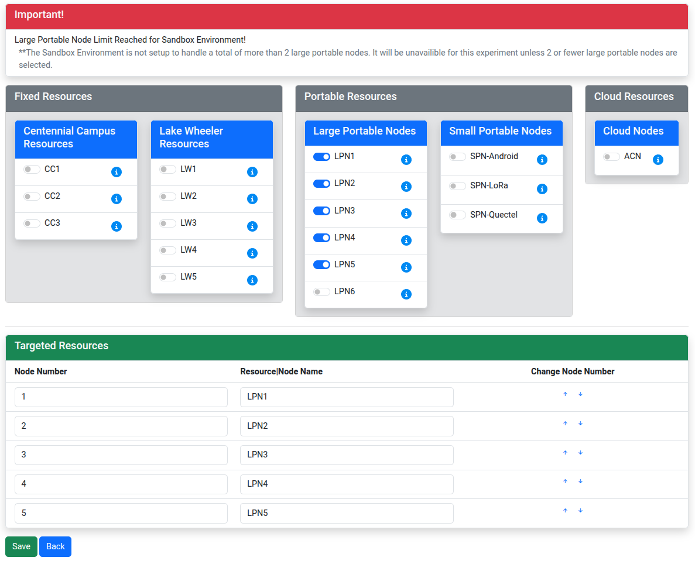

# Localization using radio fingerprinting on AERPAW

In this experiment, we will build a practical wireless localization system using USRP software-defined radios. 

Four USRPs act as fixed transmitters, each broadcasting a distinct narrowband pilot tone at a known frequency, while a fifth USRP serves as a mobile receiver. At a set of known positions, the receiver measures the received signal reference power (RSRP) from each transmitter at the same time. These measurements are stored as short vectors — one value per transmitter — that capture the unique pattern of signal strengths at each location. This collection of location-labeled vectors forms a "radio map" of the environment. 

Later, when the receiver is at an unknown location, it collects a new RSRP vector and compares it to the radio map, finding the most similar stored pattern and using its associated coordinates as the position estimate.

### Prerequisites

To run this experiment, you must have set up an account on AERPAW, uploaded an SSH key, and joined a project. If you have not yet completed these steps, you can follow the instructions in [Hello, AERPAW](https://teaching-on-testbeds.github.io/hello-aerpaw/create-account)!

## Start an AERPAW experiment

In this experiment, you are going to prepare four mobile ground vehicles (UGVs), for the radio transmitters, and one aerial vehicle (UAV) for the radio receiver.

First, log in to the AERPAW Experiment Portal. Click on "Projects" in the navigation bar, and find the project that you are a member of; click on it to open the project overview. Click on the "Create" button in the "Experiments" section. 

Now, you will have to fill in some details about your experiment:

* Select "Canonical" as the experiment type. This setting is required.
* Give your experiment a short title: you may use the template `rf_fingerprint_username`, e.g. `rf_fingerprint_ffund` in my case, for the experiment name
* Enter your university name for "host institution"
* For "title of your sponsored project", write "NA", and specify that there is no grant number
* For "Name of the lead experimenter", specify the name of your instructor or research advisor who is supervising your use of AERPAW. And, put their email address in the "email of the lead experimenter" field
* in the "Keywords: section, you can use: wireless, uav, aerpaw
* For "ultimate end destination" select "Development only".
* You can select "No" for urgency and "No" for sharing data.
* and in "expected behavior of the vehicles" you can write: "RF fingerprinting on AERPAW"

Then, click "Create canonical experiment".

From the experiment page, you will add members and resources to the experiment. Click on the "Update" button next to "Members". 

1. Select your course instructor or research advisor, click on the arrow to the move them to the list of "Chosen Members".
2. If you have team members or peers you are working with, click on the arrow to move them to the list of "Chosen Members".

Then click "Save". (Your advisor and team members will only have access to your experiment resources if you added them to the experiment at this stage - before deploying the resources.)

Back on the experiment page, click on the "Update" button next to "Targeted Resources". Then, click "Add/Update".  

On this page, you will add five resources to the experiment:

* under "Portable Resources", toggle LPN1 through LPN5.
* In the table underneath, make sure that LPN1 has node number 1, and LPN2 has node number 2, etc.

Click "Save". Then, you will modify each of the nodes by clicking "Modify" - 

* for node number 1 through 4, set the "Node Vehicle" property to "vehicle_ugv" and click "Save"
* for node number 5, set the "Node Vehicle" property to "vehicle_uav" and click "Save"

Click "Back to Experiment", then "Initiate Development".

You will receive an email with the subject "Request to initiate development session". You must then wait until you receive another email notification indicating that the development session is active.

